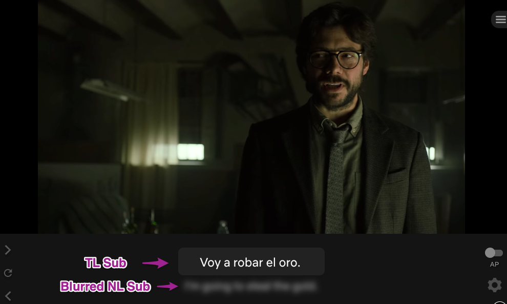

As mentioned in [Stage 0][stage-0-overview], active immersion is, hands down, the most important activity in learning your target language (TL).

During active immersion, you will focus all your attention on the content you are watching, listening to, or reading.
This intense focus signals to your brain that it should start paying attention to the TL.

In the next stage (Stage 2), you will be watching TL content without native language (NL) translation.
This can be challenging for two reasons:

1. You currently have a habit of watching only NL content.
2. Watching TL content requires you to accept your inability to understand.

### Changing Your Content Habits

In day-to-day life, we eat, breathe, live, and entertain ourselves with NL content.
It’s what we grew up with, it’s only natural.
Most people aren’t used to consuming content they don’t understand.
Especially not in other languages.

Learning through immersion means consuming content you don’t understand and aren’t quite comfortable with, at least at first.

It takes hundreds of hours of watching, listening, and reading for your brain to make sense of your TL.
The more you immerse with your TL, the more quickly you progress.
To accumulate those hours, you will need to reduce time spent with NL content to make room for TL content.

**To get started, aim for at least 30 minutes per day of active immersion in your TL.**

During this phase, you should explore the available video content in your TL.
Explore different types of media: cartoons, anime, serials, dramas, movies and so on.
Shop around.
Try different genres, and get acquainted with the tropes.
If you find a director or scriptwriter or actor you like, watch more of what they’ve made.

Try things that you would never watch in your NL.
Explore the culture.
You may be surprised by the culturally specific content you enjoy.

When you discover things you really like, make a note of them.
In Stage 2 you will start learning directly from the immersion material on this list.

Tricks to help you get started:
* Create a separate YouTube account. Take advantage of YouTube's recommendation algorithm.
* Watch with NL subtitles to help you enjoy your immersion as you build this new habit.

### Accepting Ambiguity
If you haven't read the article on [tolerating ambiguity][stage-0-tolerating-ambiguity], STOP and read it before reading the rest of this article.

One of the hardest parts of language learning is not understanding your TL.
It can make you feel stupid, depressed, and frustrated.
Don't let this discourage you.
This is a natural part of the process that everyone goes through.

These negative emotions stop your brain from learning the language.
This phenomenon is called the Affective Filter Hypothesis.[1](#footnote-1)
It's important to work through the emotion so you can enjoy your immersion.

It is impossible to skip this phase of learning.
Working through the ambiguity is a necessary part of the language acquisition process, but don’t worry.
Remind yourself that it’s only temporary and that you _will_ get through it.

By the end of Stage 1, you will have trained yourself to be comfortable with not understanding.

### How to Accept Ambiguity

When first getting started, it’s OK to use NL subtitles to aid your understanding and help you avoid frustration.
Watching with NL subs doesn’t directly help with language learning, but it does help you build a habit of consuming TL content and builds a body of content you can rewatch later.
You should move away from NL subtitles once you are comfortable with the daily habits laid out in this stage (1A).

Once you remove NL subtitles, it will be harder to follow the plots of the shows you watch, so you will need to learn to tolerate the ambiguity of not knowing exactly what’s going on.
Here are a few things you can do to help you build a tolerance to ambiguity:

### Limit NL Subtitle Usage

The tool [Language Learning with Netflix][llwn] can be configured to blur NL subtitles.
This way, you are prevented from seeing the translation unless you really need to.

Try to limit the number of subtitle lines you look at.
For example, only look at ten translations in a 30-minute episode of a show.
Reduce this number until you can watch an entire episode without checking the translations.

### Rewatch Content

We all have favorite shows where we know the story, characters, and dialogue by heart.
Netflix has many of these shows dubbed in various languages.
Pokemon, for example, is available in 15 languages.
Try watching these in your TL.
Because you are already so familiar with the show, you can stay engaged even without understanding the words.
This allows you to focus your attention on the language rather than trying to follow the story.

### Watch Simpler Shows
Children’s shows and sitcoms usually provide a lot of visual context to support your understanding.
This can help you follow the story even if you don’t understand the words.

This can also be an opportunity to watch culturally significant shows.
These are shows that get referenced in other media and in daily life.
A quick Google search will uncover which shows native speakers your age used to watch.

Note of advice: don’t force yourself to watch children’s shows if you don’t enjoy them.
Enjoyment is more important than comprehensibility.

### Make It a Game

In order to stay engaged with incomprehensible content, you can create minigames for yourself:
1. Focus on the sounds.

    Try to focus on the sounds of the language rather than the meaning.
    In Stage 1B: Phonetics, you will learn that your TL has sounds that your brain can’t hear yet. Try listening for these sounds.
  
2. Listen intently to the words.

    Try to identify where one word ends and another begins.
    Make mental notes of what it sounds like when two words blur together.
  
3. Search for known words

    As you learn vocabulary, search for these words in your immersion.
    See how many known words you can pick out.

  
### Footnotes:
<a name="footnote-1">1</a>: [Affective Filter Hypothesis, Wikipedia](https://en.wikipedia.org/wiki/Input_hypothesis#Affective_filter_hypothesis)

[stage-0-overview]: /roadmap/stage-0/overview
[stage-0-tolerating-ambiguity]: /roadmap/stage-0/b/tolerate-ambiguity
[llwn]: https://languagelearningwithnetflix.com/
