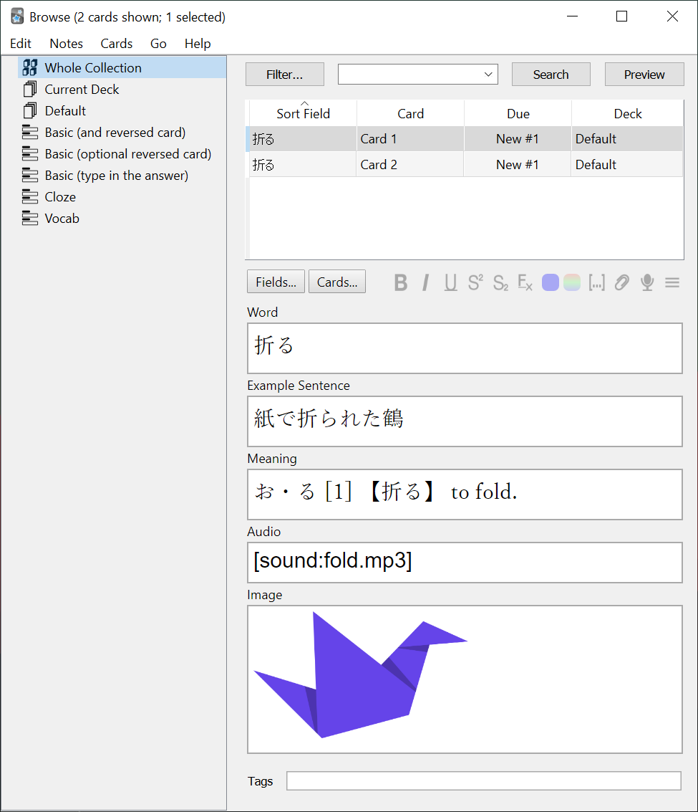
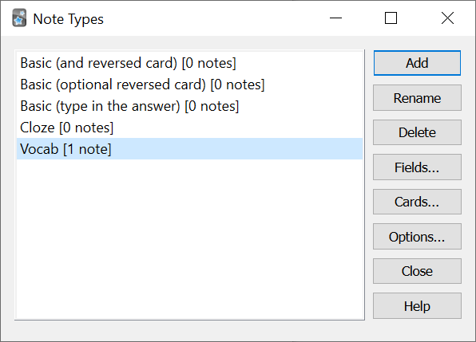
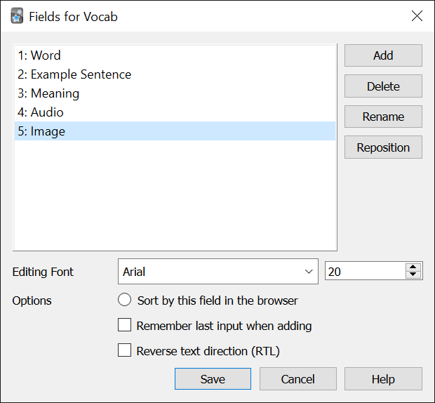
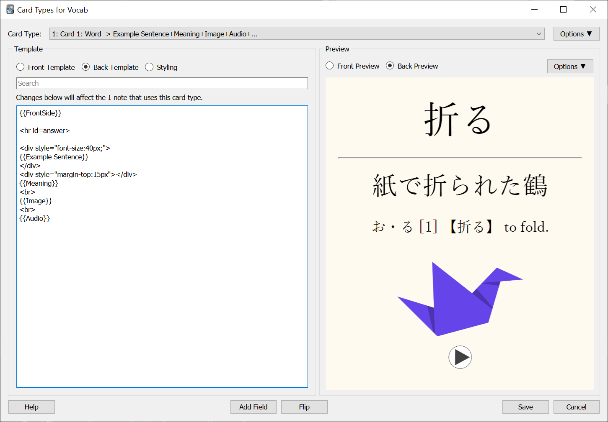
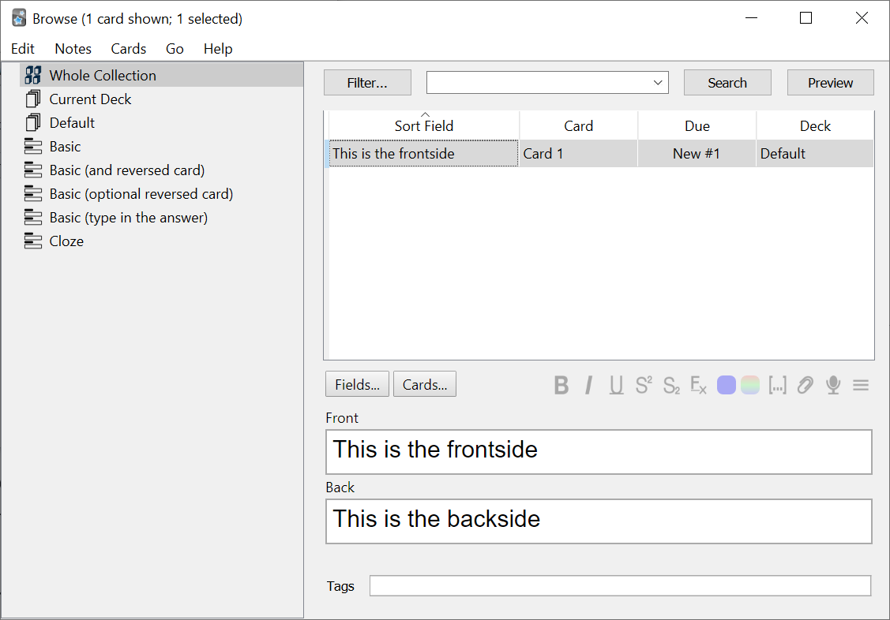
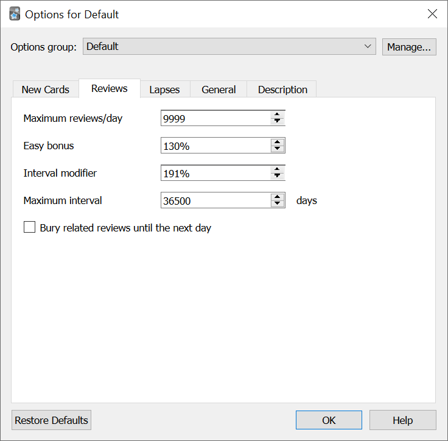
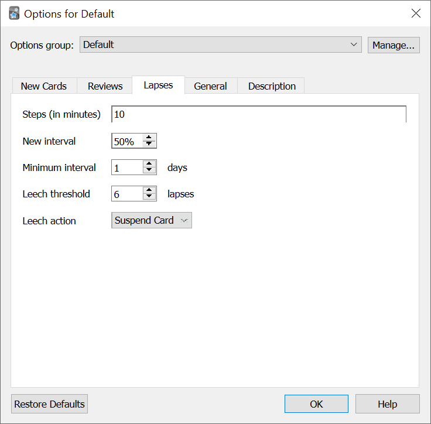
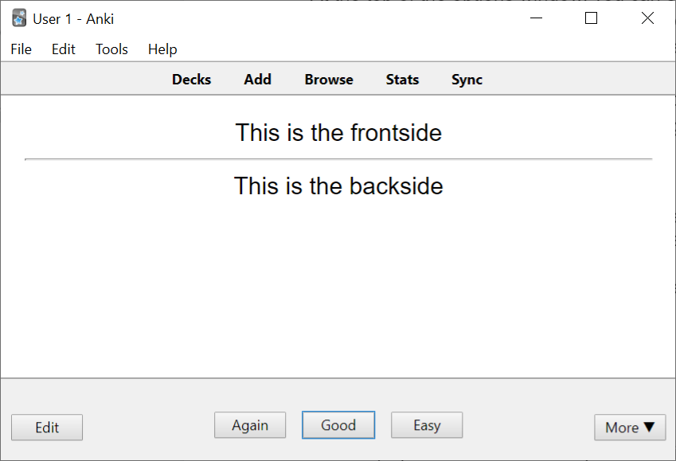
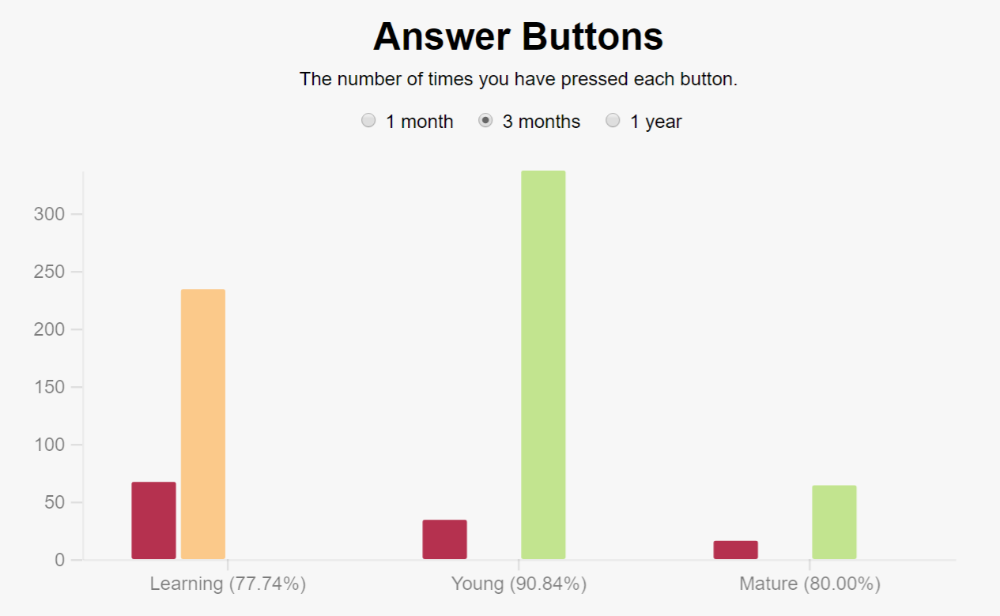

As explained in [Stage 0: Active Study][stage-0-active-study], we’ll be using a spaced repetition system (SRS) to actively study target language (TL) vocabulary.

There are many different SRS programs, but we recommend Anki.
It’s multi-platform, rich with features, and free on most platforms.
The only downside is that it can be difficult to learn how to use.
If you find yourself confused about how Anki works, don’t worry: you’ll get the hang of it after a week or two.
The bulk of this article will focus on explaining the basics of Anki.
To help you get things up and running as quickly as possible, we won’t go into exactly what all the settings do or all the logic behind our recommendations.

Towards the end of the article, we’ll also provide some resources for advanced users who want to understand the behind-the-scenes of Anki more deeply.

### Installation

The newest stable version of Anki can be downloaded from the [Anki website][ankidownload].
The desktop version is completely free and is compatible with Windows, Mac, and Linux.

There is an official iOS app, [AnkiMobile][ankimobile], which can be purchased from the app store for $24.99 (price varies per country).
There is a 3rd party Android app, [AnkiDroid][ankidroid], which is available for free on Google Play.
There is also an official fully-online version of Anki: [AnkiWeb][ankiweb].

AnkiMobile, AnkiDroid, and AnkiWeb are great for reviewing cards, but the interface for creating cards is limited.
For now, we'll focus on how to add new cards on the desktop version.

The rest of this article will focus on setting up the desktop version of Anki.

### The Building Blocks of Anki

#### Decks

When you open up Anki, the first thing you see is your list of decks.
Initially, you will only have one deck: “Default”.

Decks are essentially groups of flashcards.
When studying, you study one deck at a time.

You can create a new deck by pressing the “Create Deck” button at the bottom.
You can have as many decks as you want, and there is no limit to how many cards can be in a single deck.

In general, we recommend putting all your cards into one or two decks.
Splitting your cards up into many decks makes answering cards artificially easier.
For example, if you had a deck just for “animal names”, when reviewing cards in that deck, your brain would automatically know that the answer must be an animal name.
This “hint” would make recalling the answer easier.
Since you won’t have these sorts of hints to rely on in real life, it’s best to practice without them.

#### Notes and Cards

The distinction between notes and cards is probably the most confusing aspect of Anki.
If it doesn’t make sense at first, don’t worry.
To start using Anki you only need to know that these exist.
Over time, it will make more sense.

The most basic unit of Anki is a “note”, which is an abstract idea.
You can’t touch and hold a note, which makes it all the more perplexing.

A note is a collection of data that belongs together.
As an example, you could have the following five pieces of data:

* The written form of a word in your target language
* A sentence that uses the word in context
* A rough translation of the word in your native language
* The audio of a native speaker saying that word
* A picture that you found on Google Images when searching for the word

So a note is these five pieces of data, bound together (invisibly).

These values get turned into flashcards (or “cards” in Anki’s terms).
These are the cards that you review on a day-to-day basis.

To summarize: a note is a collection of data, and that data is used to generate one or more cards.

You might be wondering how these cards get created, which brings us to yet another abstract concept: note types.

#### Note Types

A note type is even more abstract than a note, and you will be forgiven if you are confused right now.

A note type is a blueprint for notes.
It consists of:

* A name
* A list of fields
* A collection of card types

To reprise the example from above, the name of the note type might be “Vocabulary”, because it is used to create notes that will generate vocabulary cards.

The list of fields could be:

* Word
* Example Sentence
* Meaning
* Audio
* Image

Each field is the placeholder for the data that will be stored in the note.

#### Card Types

Card types are visual templates that Anki fills in with data to generate cards.
This is where you decide what the card will look like and what data will go on the front and back of your cards.
Anki lets you create multiple card types for a single note type, but we don’t recommend doing this.

#### To Summarize

* The Note holds the data.
* The Card is what you review.
* The Note Type describes what data the note can hold.
* The Card Type configures what is shown on the card.

If a change is made to a note type, all cards associated with that note type will instantly change as well.
If a change is made to a card type, then all cards associated with it will also change.

Anki comes with five note types.
You can modify these note types, as well as create new ones from scratch.
To modify or create note types, go to “Tools > Manage Note Types” from Anki’s main window.

### Adding Cards

Anki doesn’t come pre-loaded with any material to learn.
Instead, you either make your own cards or import a deck of pre-made cards.

To create new cards, open up the add window by clicking “Add” at the top of Anki’s main window.

At the top of the add window, you can select which note type you want to use, and which deck you want the card to go into.
Then fill in the relevant fields and press “Add”.

#### Pre-made Decks

In addition to making your own cards, you can download decks made by other people from the [Anki website][ankipremade].

Because every card is always associated with a note type, when you add someone’s deck to your collection, it will usually come with a new note type.
This note type will be added to your collection, and you will be able to use it when making new cards yourself.

### Browser

The browser is where you can view all the cards in your collection and make any necessary changes.

To open the browser, click on “Browser” at the top of Anki’s main window.

When looking for cards in the browser, you can filter by deck, note type, or tags.
You can also use the search window.

You can modify the content of a card’s field simply by selecting it in the browser.
To delete a card or move it into a different deck, right-click on the card and select the relevant option.

### Preferences

Preferences are global settings that affect the entire Anki program.
You can access preferences by going to “Tools > Preferences…” on Anki’s main window.

There is one setting in Preferences we recommend changing: “Show next review time above answer buttons” in the Scheduling tab.
When this is turned on, when reviewing cards, an estimate of the next time a card will be shown is displayed above each answer button.
This can make you second-guess your memory and grade cards too conservatively.
It’s better to trust the algorithm and not worry about the specific numbers.

If you would like to sync your Anki collection with an AnkiWeb account, you can set that up in the “Network” tab.
This will let you sync to Anki on your other devices.

### Options

Options are where you customize the specifics of how Anki’s algorithm works.
Options are set on the level of individual decks.

At the top of the options window, you can see which “options group” is being applied to the current deck.
An options group is a set of options.
You can create an option group for each deck, or have multiple decks share a single options group.

If you use multiple decks, we recommend creating a separate options group for each deck.
You can create a new options group by pressing “Manage..” on the top right, and selecting “Add”.

### Recommended Options Settings

The default options settings that Anki comes with are very problematic.
It’s important to adjust them to something more suited to language learning.

Below are the options settings we recommended using:

The only option we recommend personalizing is the “New cards/day” setting in the “New Cards” tab.
This option controls how many new cards Anki will show you each day.
We will explain how to determine what value to set this to in a later article.

#### Fixing Old Settings
If you've been using Anki for a while then you'll need to update older cards and remove older addons.

To update older cards, use the [Refold Ease][refold-ease] add-on.
The default settings of Refold Ease are good enough (though we are aware of the 1% discrepancy on interval modifer).

If you have any of the following addons installed, they should be removed:

1. No Penalties or Boosting
1. ResetEZ

### Studying

To study a deck, select the deck from Anki’s main window, and press “Study Now”.

When studying, Anki will show you the front side of a card, and prompt you to reveal the backside with “Show Answer”.
Once the backside of a card is shown, you’ll be prompted to grade it.

When grading a card in Anki, you’re asked to choose from up to four different options: “again”, “hard”, “good”, and “easy”.

(For reviews, all these options will be shown.
For new cards, only “again”, “good”, and “easy” will be shown.
For lapsed cards, only “again” and “good” will be shown.)

**We strongly recommend ONLY using the “again” and “good” buttons, and avoiding the “hard” and “easy” buttons.**

The “hard” and “easy” buttons have counterintuitive effects on Anki’s algorithm, which causes long-term problems.
For more information on why this is, please see the “Low-key Anki” section at the end of this article.

### Stats

You can view various statistics about your studies by clicking on “Stats” from Anki’s main page.

The most important statistic to pay attention to is your “retention rate”: the percentage of cards that you grade “good” or “easy”.
Your retention rate is shown in the “Answer Button” section of the stats page.

Your retention rate is split into three categories: Learning, Young, and Mature.
“Learning” corresponds to cards that are in the process of being learned.
“Young” corresponds to cards that you have fully learned, but you continue to review at least once every 20 days.
“Mature” corresponds to cards that you only review every 21 days or more.

Retention rate only matters for Mature cards.
“Learning” cards are cards you haven’t fully learned yet, so it’s natural you won’t remember them.
Similarly, “Young” cards are cards you’ve learned recently, and so they aren’t yet strongly rooted in your memory.

In the context of language learning, the ideal retention rate for mature cards is between 80% and 90%.
In Stage 1C: Best Practices, we provide recommendations for how to handle a retention rate outside of this range.

### Beginners Stop Here

The rest of this article covers in-depth details about Anki’s algorithm.
If you’re new to Anki, skip this section and move on to the [next article][stage-1b-phonetics].

### Advanced Usage

You can get 90% of Anki optimizations by following the instructions above.
However, if you want to fully optimize you need to learn how Anki's algorithm works.
If you’re new to Anki, come back to this section in a month or two after you’re comfortable with the basics of the program.

#### The Algorithm Fully Explained

The following video fully explains Anki’s algorithm and the effects of all the various option settings.

* [Anki Tutorial | Deck Options and Anki's Algorithm][explanation-anki-algorithm]

### Low-key Anki

Low-key Anki is a modification to Anki’s algorithm that’s popular within the Refold community.
In the context of language learning, Low-key Anki vastly improves the effectiveness of the algorithm by avoiding many of the default algorithm’s pitfalls.

Low-key Anki has already been incorporated into the option settings and review instructions provided above.
As long as you mimic the recommended option settings and follow the review instructions, you will get the full benefits from Low-key Anki.

If you would like to understand the underlying logic behind Low-key Anki, please read [this series of articles][explanation-lowkey-anki].

### “Low-key” Low-key Anki

Low-key Anki consists of two components: only using the “again” and “good” buttons, and the removal of all ease factor changes.
As explained in the series of articles linked above, originally, this was implemented with the use of an add-on that prevented Anki from changing the ease factor of cards, regardless of how cards were graded.
But, it’s actually possible to implement Low-key Anki without the use of any add-ons.

Within Anki, the minimum ease factor a card can have is 130%.
Once a card’s ease factor reaches 130%, it never declines any further, even if the card is graded “again” or “hard”.
Thus, by making the starting ease of cards 130%, assuming a user never uses the “easy” button, the ease factor of cards will never change.
Since the ease factor starts out at the minimum, the “again” and “hard” buttons won’t decrease the ease factor, and the “good” button never changes the ease factor.

The low starting ease can be offset by increasing the interval modifier to 192%.
This will provide the same interval growth as a 250% starting ease and 100% interval modifier.

Unfortunately, there's a bug with Anki 2.1.35 that causes all cards with a 130% ease factor to get reset to 250% starting ease.
We've changed the minimum ease to 131% and the interval modifier to 191% to avoid this bug.

This add-on-free version of Low-key Anki is what has been implemented in the recommended option settings above.

[ankidownload]: https://apps.ankiweb.net/
[ankidroid]: https://play.google.com/store/apps/details?id=com.ichi2.anki&hl=en_US
[ankimobile]: https://apps.apple.com/us/app/ankimobile-flashcards/id373493387
[ankiweb]: https://ankiweb.net/
[ankipremade]: https://ankiweb.net/shared/decks/
[explanation-anki-algorithm]: https://www.youtube.com/watch?v=lz60qTP2Gx0
[explanation-lowkey-anki]: https://web.archive.org/web/20210203165239if_/https://massimmersionapproach.com/table-of-contents/anki/low-key-anki/intro/
[refold-ease]: https://ankiweb.net/shared/info/819023663
[stage-0-active-study]: /roadmap/stage-0/c/active-study
[stage-1b-phonetics]: /roadmap/stage-1/b/phonetics
