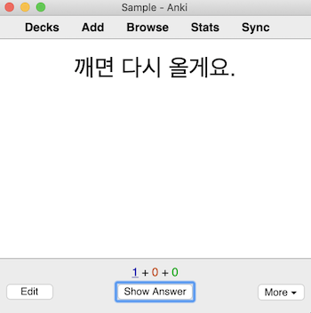

Sentence mining is the process of taking words and sentences directly from your immersion and learning them with the SRS.
You can start sentence mining as early as you like, but most people prefer to start this process after they have learned the most basic grammar structures and have memorized the most frequently used words.
If you haven’t completed your study of the most common words, then feel free to wait on sentence mining, or you can do both simultaneously.
It’s your choice.

Sentence mining unifies study and immersion.
By studying words and sentences that come directly from your immersion content, you ensure that you are focusing your study on the words that are the most relevant to you as you start to gain footing in your first domain.
Since you will be handpicking which words and sentences to learn yourself, you will have a rich connection to them.
This will help you build strong memories quickly and easily.

Sentence mining is a creative, exploratory process, and everyone has their own method.
Over time you will discover a method uniquely suited to your preferences and lifestyle.

Here are some basic guidelines to get you started.

### Choosing What to Mine

With every hour of immersion, you will encounter many unknown words that you could learn.
But, some words are going to be more worth your time than others.
Because you will only be able to make a limited number of SRS cards each day, it’s important to choose what to mine carefully.

The first thing to consider is whether you truly need a card to learn something.
If you think you’ll remember a word without the support of the SRS, then don’t make a card for it.
Some words are very similar to words in your native language (NL), and you will probably only need to hear them once or twice to learn them.
Other times a word is built up of components you’re familiar with, and once you see the connection, the meaning sticks.
And sometimes words just stick on their own, for no reason that you can point to.

That said, initially, most words will be difficult to learn without the SRS.
When narrowing down what to mine, keep in mind that the most efficient path to increasing your potential to understand—and therefore acquire—your target language (TL) is to mine sentences that are low-hanging fruit:

#### 1. Prioritize words that feel familiar.

Words that occur frequently in your immersion provide a high return on investment.
If a word seems to be drawing your attention or feels familiar to you, that’s a good indication that it’s a common word.

#### 2. Choose words that seem accessible.

If you look up a word and the definition feels hard to grasp, then skip it for now.
Your time and efforts are better spent learning words that are already within reach.

#### 3. Prioritize words that you _want to_ learn.

If a word is interesting and just seems to be calling out to you, that’s reason enough to learn it.
An emotional connection to a word makes it much easier to memorize, reducing the “cost” of learning it.
This can make learning a word worth it, even if it doesn’t seem particularly useful or frequently used.

### Mine Sentences, Not Words

As a general rule, you should create cards for phrases and sentences, rather than isolated words.
There are three reasons for this.

The first is that, oftentimes, simply knowing the meaning of a word isn’t enough to fully grasp how it’s used in the wild.
Antimoon illustrates this idea beautifully with the definition of “account for”:[1](#footnote-1)

> If a particular thing _accounts for_ a part or proportion of something, that part or proportion consists of that thing, or is used or produced by it.[2](#footnote-2)

On its own, this definition doesn’t give you a real sense of what “account for” really means or how it’s used.
However, that dictionary also provides an example sentence that makes things a lot clearer:

> Computers account for 5% of the country’s commercial electricity consumption.

In this way, a good example sentence is often crucial for really grasping a word’s usage.

The second reason for making cards based on sentences is that many words have multiple meanings.
For example, the word “bark” means something completely different depending on whether you’re talking about dogs or trees.

Trying to memorize every meaning of a word with a single card often results in cards that are excessively difficult and cumbersome to review.
It’s much more effective to learn the meanings of words one at a time.
This is an example of the minimum information principle, which is explained in more depth in the following section.

Creating cards for sentences rather than individual words is the most straightforward way to narrow your focus to a single usage of the target word: simply focus on the meaning of the word in that particular sentence.
Additionally, because the sentences will have come from your immersion content, you will be learning the particular meaning that’s most relevant to you.

The final reason for making cards for sentences is that they’re easier to remember.
Compared to an isolated word, a sentence provides a larger chunk of meaning for your brain to latch onto, and this makes it easier to internalize.

This will be particularly true if the sentence came from an actual book or show that you watched.
You’ll be able to recall what character said the sentence and what scene it was used in.
This personal connection to the sentence will make it much easier to integrate the target word into your knowledge of the language.

### Select One Target (1T) Sentences

It’s best to mine sentences that contain only one unknown element (word or grammar structure) each.
These are known as “one target” or “1T” sentences.

Some people worry that sticking to 1T sentences is slow and inefficient, but the opposite is true.
Lots of targeted, crisp flashcards will get you to your goal more quickly and with less effort.
This idea is known as the [minimum information principle][minimum-information-principle].

If you have three words that you want to learn, it is much better to have three different cards, each of which is focused on an individual target word.

If you put all three words on a single card, then if you forget one of them, you will have to fail the card, even though you remembered two of the words.
This means you’ll end up doing redundant reviews on the two you remembered.

Having to recall all three unknown words at the same time will also make the card harder to understand, making it less likely that you will fully internalize each of the words.

It would also increase the risk of introducing memory interference: even though the three words don’t have any intrinsic relationship to one another, learning them together may cause you to falsely associate them in your mind.

### What to Put On Cards

In this stage, keep your card as simple as possible: put the text of the sentence on the front.
On the back, put the definition of the target word, and (optionally) a screenshot of the scene that the sentence was taken from.

Remember: you’re not trying to produce the language; the goal of these cards is to improve your _comprehension_.
So, keep your cards simple and grade yourself based on how well you were able to understand the sentence on the front.

### When to Mine

There are two overall approaches to sentence mining: automated and manual.

Automated mining consists of using software that automatically extracts 1T sentences from your immersion material and makes them into cards.
This is an advanced technique and takes quite a bit of technical fiddling to get working, so we recommend waiting to experiment with this until later.

Manual sentence mining consists of hand-picking what sentences to learn from your immersion content and creating cards yourself.
You can do manual sentence mining either during intensive immersion while reading a TV show, or during free-flow immersion.
Try both, you may find that both are fine, or that one suits you better than the other.

There are two ways to go about manual sentence mining: synchronous and asynchronous.

In synchronous mining, when you come across a sentence you want to learn while immersing, you pause your immersion and make a card for it right then and there.
The benefit of this approach is that your active immersion and sentence mining become unified into a single activity.
This can help to streamline your overall language learning routine.

Some people find synchronous mining disruptive to their immersion.
They prefer asynchronous mining, which separates card creation from immersion.
In asynchronous mining, while immersing, you simply make note of sentences and words you want to learn.
You can do this by copying and pasting the sentence into a text file or noting down the timestamp of the sentence.
Then, at a later time, you go through the sentences you have collected and create cards for them in bulk.

### Best Practices

Our SRS recommendations don’t change from Stage 1, so feel free to reread [1C: SRS Best Practices][stage-1c-srs-best-practices].

  
### Footnotes:
* <a name="footnote-1">1</a>: http://www.antimoon.com/how/examplesent.htm
* <a name="footnote-2">2</a>: [Collins COBUILD Advanced Learner’s Dictionary](https://www.amzn.com/dp/0008253218)

[minimum-information-principle]: https://www.supermemo.com/en/archives1990-2015/articles/20rules
[stage-1c-srs-best-practices]: /roadmap/stage-1/c/srs-best-practices
