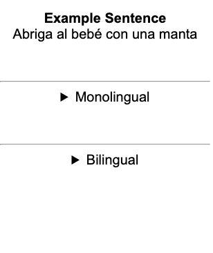
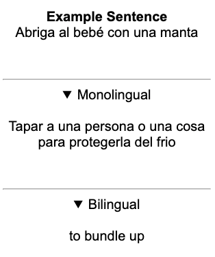

For languages that are far apart (e.g. English → Chinese), the monolingual transition can have a steep learning curve.
If the [casual approach][stage-2b-casual-monolingual-transition] isn't working for you, here is a structured guide for how to jumpstart your use of the monolingual dictionary.

If you haven’t read the [casual monolingual transition][stage-2b-casual-monolingual-transition] article, read it now before pursuing the structured approach.

### The Dictionary Domain

The dictionary is its own domain and uses vocabulary that you rarely encounter elsewhere.
This domain is quite small compared to others, but it’s a good idea to tackle this domain in a structured and deliberate manner because you won't see these words in your immersion.
Once you learn the key vocabulary for the dictionary, the definitions will become much more comprehensible.

### The Structured Approach

The following phases explain how to actively study the dictionary domain and overcome the learning curve of the monolingual dictionary.
Go at your own pace and move on to the next phase when you feel ready.

#### 1. Mine the Dictionary

Set aside time each day to look up the monolingual definitions of words you already know.
If there are unknown words in the definitions, then use a bilingual dictionary to help you understand them.

Most words have multiple meanings and definitions, so try to identify a definition that matches the meaning you already know.
If you can find one, then create bilingual cards for the unknown words in that definition.

#### 2. Recursive Lookups

Continue to mine the dictionary by looking up known words, but try to use the monolingual dictionary to understand any unknown words in the definitions.
Try to puzzle through the meaning of these words and then check your understanding against the bilingual dictionary.

Continue to create bilingual cards for unknown words.

#### 3. Add Both Languages to Cards

While sentence mining, try to understand unknown words in the monolingual dictionary first before reverting to the bilingual.

If you can clearly identify a definition that matches the meaning of the word in the target sentence, then include both monolingual and bilingual definitions on your card even if you don’t fully understand the monolingual definition.

Use HTML Summary tags to hide both definitions.
When you review the card, read the monolingual definition first before the bilingual one.

For any unknown words in the definition, create cards with both monolingual and bilingual definitions.
Schedule these cards several days before the original target sentence card.

Here's a sample Anki deck with an example card type that uses the summary tag to create hidden sections:

* [Example Anki deck][sample-anki-deck-with-summary-tag]

This is what the hidden sections look like when collapsed:

Here, the hidden sections are expanded:

#### 4. Switch to the Monolingual Dictionary

Start using the monolingual dictionary as your primary dictionary, both while sentence mining and while doing lookups during immersion.
It’s fine to fall back on the bilingual dictionary when you need it.

You’ve completed the transition when you can understand 90% of your lookups in the monolingual dictionary without needing to rely on the bilingual dictionary.

[sample-anki-deck-with-summary-tag]: https://drive.google.com/file/d/1oRTHZ3LCQrjLeieIGjQ6qN8ljONJ1gd3/view?usp=sharing
[stage-2b-casual-monolingual-transition]: /roadmap/stage-2/b/casual-monolingual-transition
