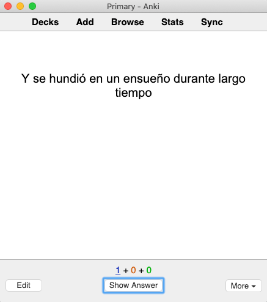
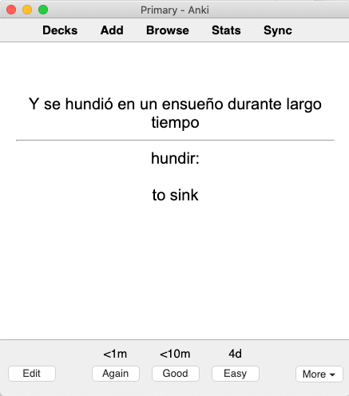

Sentence mining is the process of finding new words from your immersion and making Anki cards to learn them.
We call it “sentence mining” because you use the sentence you found the word in as an example sentence on your card.
Sentence mining is powerful because it allows you to learn the words that are most relevant to your personal immersion experience.

You can start sentence mining at any time, but it will be difficult if you don't already have a solid foundation of vocabulary and grammar.
We recommend learning at least 1000 words before starting to sentence mine.

### Sentences, Not Words
We highly recommend putting an example sentence on each of your cards.
Cards with only a word and its definition cause multiple problems in the learning process:

**1. Most words have multiple meanings**

Some words even have dozens of different meanings.
Learning all of these meanings at the same time is too difficult.

Choosing an example sentence allows you to narrow your focus down to the single meaning that's relevant to that sentence.
In this way, learning one meaning at a time is a much more effective way to learn vocabulary.

**2. A word alone is hard to remember**

An isolated word is abstract.
It's hard to remember abstract things.
Adding an example sentence adds extra context to the word.
Instead of an abstract idea or concept, the sentence helps fill in a concrete image that's easier for your brain to latch onto and remember.

**3. Words aren't used alone**

When the word is by itself without any surrounding context, you don't know how it's used when combined with other words.
An example sentence shows you how the word fits into the broader language.

### How to Choose Sentences
Not every sentence is good for learning.
There are two major criteria you should consider when deciding if a sentence is a good example for a word.
Sentences that meet both of these criteria are called 1T sentences.

**1. A single unknown element**

A good example sentence should only have one unknown word or grammar structure.
If there are multiple unknowns, don’t use that sentence.

**2. Perfect comprehension**

When you look up the definition of the unknown word or the explanation of the unknown grammar structure, the meaning of the sentence as a whole should become clear to you.
If it still doesn't make sense after a lookup, then it's not a good example sentence.

### How to Choose Words
Not every word is worth learning.
To decide on which words to learn, use the following criteria:

1. Does the word seem like it would be useful in everyday conversation?
1. Is the word necessary to understand your immersion content?
1. Have you seen this word before? Does the word feel familiar?
1. Is the word personally interesting to you?

If the answer is yes to any of those questions, then you should learn the word.

### When to Mine
Intensive immersion is the best time to sentence mine.
You are already doing word lookups and trying to understand sentences so it's easy to pick out good 1T sentences in the process.

There are multiple methods for creating cards from mined sentences:
1. Create cards while you immerse (synchronous mining).
1. Save sentences you want to learn and then create cards later (asynchronous mining).
1. Use software to automatically create cards (automatic mining).

Synchronous mining is the most popular method in the community, so we recommend starting with that.
There are many tools available to help make synchronous mining easy.

Join the [Refold community][join-link] for recommendations of which tool has the best support for your TL.

### How to Create Cards
There are many different card formats you can use.
We recommend starting with cards that only contain text because they are easiest to create.
There are two types of text cards: vocabulary and sentence.
There are pros and cons to each, which you can learn about in this [video][vocab-vs-sentence-video].

In [Stage 1][vocabulary-cards], we recommended vocab cards because you didn’t know enough words to understand full sentences.
Now that you’re in Stage 2, we recommend switching to sentence cards.

#### Sentence card format:
* Front: Example sentence
* Back: Definition of target word

Once you are comfortable with Anki, you can create cards with pictures and audio.
You can learn more about advanced card formats [here][advanced-mining].

#### Example Flow

* Step 1:  Find a 1T sentence in your immersion.
* Step 2: Put the sentence on the front of a card

* Step 3: Put the definition on the back of the card

### Translations
We do not recommend putting a full translation of the sentence on the card.
Different languages have different ways of expressing ideas so translations are nearly always inaccurate.
If the sentence is 1T, then you should be able to understand it without a translation.

### How many Cards?
We recommend learning 10 new cards per day.
You can do more than 10 if you want, but remember that Anki reviews add up and can become overwhelming.

To estimate the number of reviews you'll have, multiply the number of new cards you learn per day by 7.
For example, if you do 10 cards per day, then after a few weeks, you'll have about 70 reviews per day.

[join-link]: /join
[vocab-vs-sentence-video]: https://www.youtube.com/watch?v=GLfmKWhLhjk
[advanced-mining]: /roadmap/stage-2/b/advanced-sentence-mining
[vocabulary-cards]: /simplified/stage-1/a/vocabulary#Creating-Your-Own-Deck
