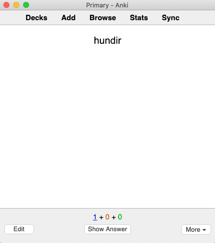

Cuando empiezas el proceso de adquisición del idioma, tu primer objetivo es construir una base de comprensión. Necesitas de una comprensión suficiente para empezar a aprender directamente de tu inmersión. Como se mencionó en el último artículo, la forma más rápida de construir esta base es memorizar el vocabulario más común.

### Herramientas de estudio

Existen diferentes técnicas y herramientas de memorización. En nuestra opinión, los sistemas de repetición espaciados (SRS) son, con diferencia, la herramienta de memorización más eficaz.

Un SRS es un programa de fichas que intenta hacer un seguimiento de qué tan bien sabes el contenido de cada ficha y te muestra de manera efectiva las tarjetas que piensa que estás a punto de olvidar. Esto significa que puedes mantener una gran cantidad de información en tu cabeza, a la vez que minimizas repasos innecesarios.

La mejor herramienta de SRS disponible actualmente es [Anki][anki]. Anki tiene muchas funcionalidades y extensiones que son de ayudan para el aprendizaje de idiomas. Es gratis en computador, web y Android, pero cuesta $25 en iOS.

Anki es un poco complicado, así que lo mejor es reservar un poco de tiempo para instalar y configurarlo. Puedes encontrar una guía completa sobre cómo empezar con Anki [aquí][anki-guide].

### Estrategia de estudio

En el aprendizaje por inmersión, tu objetivo es entender; no hablar. Esto significa que sólo necesitas construir un vocabulario pasivo: el conjunto de palabras que puedes reconocer y entender.

No es necesario que practiques recordando las palabras de memoria. Para cuando llegues a la Etapa 3, tu cerebro comenzará naturalmente a convertir tu vocabulario pasivo en vocabulario activo y podrás recordar las palabras sin esfuerzo adicional.

### Escoger una lista de palabras

Los "mazos" de Anki son colecciones prefabricadas de tarjetas Anki que puedes descargar y estudiar. La comunidad Refold está trabajando duro en la creación de mazos de Anki ideales para los nuevos estudiantes.

Para acceder a estos mazos, únete de manera gratuita a la [comunidad de Refold en Discord][join-link] de tu lengua meta.

Si no hay ningún mazo de Refold disponible para tu lengua meta (L2), puedes usar un mazo prefabricado de una fuente diferente, o puedes crear tu propio mazo.

#### Elegir un mazo prefabricado

En un buen mazo, cada tarjeta tendrá una palabra, una oración de ejemplo, una definición, e idealmente un audio para la palabra u oración.

La comunidad Refold ha compilado listas de los mejores mazos existentes para cada idioma. Únete a la [comunidad][join-link] para acceder a estas recomendaciones.

#### Creando tu propio mazo

Si no encuentras un buen mazo prefabricado que se ajuste a los criterios anteriores, puedes crear uno propio y compartirlo con la comunidad.

El primer paso para crear un mazo es elegir las palabras que quieres aprender. La mejor manera de hacer esto es con una lista de frecuencia. Una "lista de frecuencia" es una lista de palabras ordenadas de más a menos comunes. Puedes encontrar listas de frecuencia para cualquier idioma haciendo una búsqueda en Google.

A la hora de elegir una lista de frecuencia, asegúrate de que sea una lista de palabras raíz, y no de palabras conjugadas o con inflexiones. Por ejemplo, "caminar" y "caminando" deben ser tratadas como la misma palabra.

Si su idioma nativo (L1) y L2 están relacionados (como el inglés y el español), entonces habrá muchas palabras compartidas entre los dos idiomas. Estas palabras compartidas se llaman "cognados" y no necesitas estudiarlas.

Una vez que tengas tu lista de palabras, necesitarás reunir la información necesaria para cada palabra y cargarla en Anki. Hay muchos tipos de tarjetas que puedes crear, pero te recomendamos que las hagas simples.

En el frente de la tarjeta, pon la palabra. 

En la parte posterior, pon una frase de ejemplo y una definición. 

A los principiantes también les podría interesar colocar una traducción de la frase de ejemplo en la parte posterior para ayudarles a entender. Sin embargo, a medida que mejoras, deberías evitar usar traducciones porque casi siempre son inexactas.

Recuerda que sólo estás estudiando para el reconocimiento y la comprensión. Asegúrate de que la parte frontal de la tarjeta no tenga ninguna información en tu L1, sólo de tu L2.

### SRS Prácticas recomendadas

Cada palabra nueva que aprendas vuelve a aparecer más adelante, múltiples veces, en forma de repaso. Uno de los errores más comunes que cometen los principiantes es el aprender demasiadas tarjetas demasiado rápido. Demasiadas tarjetas nuevas llevan a demasiados repasos, lo que a menudo lleva al desgaste.

Enfócate más en ser consistente que en la cantidad. Recomendamos añadir 10 tarjetas nuevas por día. Con 10 cartas nuevas al día, puedes esperar tener alrededor de 70 repasos por día. Toma alrededor de dos semanas para que tu número de revisiones refleje los cambios al número cartas nuevas.

Si en algún momento sientes que es demasiado y te das por vencido, entonces deja de añadir cartas nuevas hasta que el número de repasos vuelva a nivel más manejable. Siéntete libre de bajar a 5 cartas nuevas al día, o cualquier número que te sea viable.

[anki]: https://apps.ankiweb.net/
[anki-guide]: /roadmap/stage-1/a/anki-setup
[join-link]: /join
[join-link]: /join
