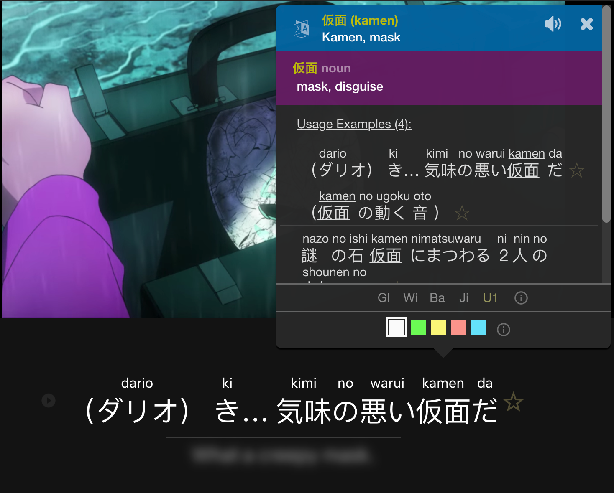

Imersão intensiva é uma ótima forma de desenvolver capacidade de leitura e vocabulário. No início, ler livros e blogs será muito difícil. Em vez disso, recomendamos assistir programas de TV com legendas na sua língua-alvo (LA).

Existem quatro motivos principais para recomendarmos começar com legendas:

1. A parte visual fornece um contexto adicional que te ajuda a entender.
1. O áudio te ajudará a aprender a pronúncia correta das palavras que está lendo.
1. Ouvir as legendas pronunciadas em voz alta te ajuda analisar a gramática das frases.
1. Legendas são o texto escrito de uma conversa. Conversas geralmente têm uma linguagem mais fácil do que livros e blogs.

### Como Fazer Imersão Intensiva

Durante a imersão intensiva, seu objetivo é entender o máximo possível. Para isso, pare após cada frase da legenda e tente entendê-la. Caso encontre palavras desconhecidas, busque-as no dicionário.

Enquanto imerge, algumas coisas serão fáceis de entender e outras serão difíceis. Haverá muitas frases que você não conseguirá entender, mesmo com a ajuda de um dicionário.

Concentre-se em aprender as coisas para as quais seu cérebro já está pronto. Se você não conseguir entender uma frase após 10 segundos, passe para a próxima.

No ensino tradicional, fala-se de esforçar-se muito para aprender coisas difíceis. Na imersão, a melhor estratégia é concentrar-se apenas nas coisas fáceis. À medida que sua compreensão cresce, as coisas que antes eram difíceis tornam-se fáceis.

### O que Assistir

#### Legendas

Sem uma boa habilidade auditiva, entender palavras apenas pelo áudio é muito difícil. É importante encontrar conteúdo em que as legendas da LA coincidem com o áudio da LA. Sem legendas, você não conseguirá fazer imersão intensiva com TV e filmes.

Legendas LA em conteúdos feitos para nativos geralmente coincidem com o áudio, mas isto geralmente não se aplica com conteúdo dublado. Para iniciantes, ter legendas que coincidem com o áudio é de suma importância para ouvir a pronúncia correta das palavras. Quando você estiver mais avançado, não há problema em assistir com legendas não correspondentes.

A maioria das línguas comuns e mais faladas têm muito conteúdo com legendas. A comunidade Refold está compilando uma lista deste conteúdo para facilitar a iniciação.

No entanto, idiomas menos falados podem não ter legendas disponíveis. Se você não conseguir encontrar nenhum conteúdo na sua LA com legendas, recomendamos fazer imersão intensiva com quadrinhos. Explicaremos mais sobre a leitura de quadrinhos na Etapa 2B.

#### Conteúdo para Crianças

Conteúdo nativo destinado a adultos (maiores 16 anos) é difícil para iniciantes. O mais fácil é começar com conteúdo para crianças em vez disso.

Nós recomendamos começar com programas de TV para crianças com idades entre 7 e 14 anos. Programas para crianças têm enredos e diálogos mais simples, o que os tornam mais fáceis de entender.

Não recomendamos programas para bebês. Há muito pouco diálogo nestes programas e são entediantes para adultos.

#### Revendo Conteúdo

Aumentar a compreensão é a melhor maneira de acelerar a aquisição. Quanto mais compreensível algo for, mais envolvente será e mais o seu cérebro conseguirá absorver.

Uma excelente estratégia para aumentar a compreensão e o envolvimento é assistir algo duas vezes: uma vez com imersão livre e outra com imersão intensiva. Como você já viu o programa uma vez, você terá mais contexto, mais compreensão e sua imersão intensiva será mais envolvente. A segunda vez permite que você preencha lacunas de tudo o que não entendeu pela primeira vez.

Para programas que você nunca assistiu antes, pode ler resumos antes ou depois de assistir. Isso te ajudará a compreender a história, te dá dicas sobre as palavras e ajuda a manter o envolvimento.

### Evitando o Esgotamento

Imersão intensiva pode ser mentalmente cansativa. Ela requer muita energia e atenção. Quando estiver cansado de fazer imersão intensiva, faça imersão livre.

Se consumir um conteúdo tornar-se algo pesado, mude para outro. Não vale a pena se forçar a imergir com esse conteúdo. O prazer é a parte mais importante do processo.

### Ferramentas de Imersão

#### Dicionários Pop-Up

Ao assistir ou ler algo, você deve buscar palavras num dicionário. Usar um dicionário digital é muito mais rápido do que usar um dicionário físico, mas ainda requer que você mude de janelas para procurar.

Dicionários pop-up permitem que você busque palavras dentro do aplicativo que está usando. 

Se você usa Netflix, recomendamos a extensão para Chrome [Language Learning with Netflix][llwn-link]. Esta extensão te permite buscar palavras após uma pausa automática a cada frase com um dicionário pop-up integrado. A extensão é gratuita, mas também tem uma versão paga com alguns recursos adicionais que pode ser de seu interesse.

A mesma empresa criou a extensão [Language Learning with YouTube][llwyt-link].

Eis alguns outros dicionários pop-up que você pode usar enquanto navega a web:

-   [Dicionário][mac-dictionary] integrado do Mac
-   [Yomichan][yomichan] (para japonês)

#### MPV

Se você preferir assistir conteúdo localmente no seu computador, recomendamos o reprodutor [MPV][mpv-link]. O MPV é open source e muitos membros da comunidade criaram extensões que fazem do MPV uma ferramenta de aprendizagem de idioma perfeita.

A instalação é um pouco complicada, por isso criamos um [guia em vídeo][mpv-guide] para ajudar a configurá-lo.

### Procurando Conteúdo Legendado

#### YouTube

O YouTube é um ótimo recurso para encontrar programas de TV e outros conteúdos nativos interessantes. Todo vídeo no YouTube tem legendas geradas automaticamente, mas elas não são exatas. Para encontrar conteúdo com legendas precisas, use o [ recurso de pesquisa avançada][youtube-sub-search] do YouTube.

#### Netflix

Se você estiver usando Netflix, qualquer conteúdo criado originalmente na sua LA terá legendas correspondentes.

Se você está assistindo dublado, procure legendas marcadas como "CC" (Closed Captions, legenda oculta, originalmente destinada a deficientes auditivos). Se a legenda não está marcada como CC, provavelmente não corresponderá ao áudio.

#### Serviços de Streaming LA

Lembre-se de experimentar novos sites de streaming. Cada país tem diferentes serviços de streaming. Estes serviços provavelmente terão muito conteúdo disponível com legendas correspondentes.

#### Refold

Nossa comunidade coletou listas de conteúdo com legendas correspondentes. Clique [aqui][join-link] para ter acesso às nossas listas.

[join-link]: /join
[llwn-link]: https://languagelearningwithnetflix.com/
[llwyt-link]: https://chrome.google.com/webstore/detail/language-learning-with-yo/jkhhdcaafjabenpmpcpgdjiffdpmmcjb
[yomichan]: https://chrome.google.com/webstore/detail/yomichan/ogmnaimimemjmbakcfefmnahgdfhfami
[mac-dictionary]: https://wokabulary.com/blog/the-built-in-dictionary-on-mac-and-iphone.html
[mpv-link]: https://mpv.io/
[mpv-guide]: https://youtu.be/bbg6ztWecbU
[youtube-sub-search]: https://support.google.com/youtube/answer/3029103?hl=en
