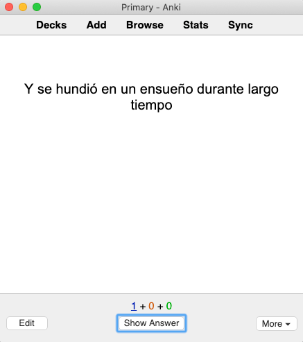
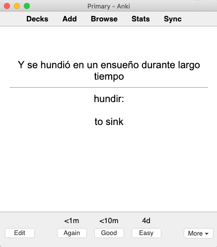

Extração de frases é o processo de encontrar novas palavras na sua imersão e fazer cartas no Anki para aprendê-las. Chamamos isso de "extração de frases" porque usamos a frase em que encontramos a palavra como uma frase de exemplo na carta. A extração de frases é uma ferramenta poderosa, pois permite que você aprenda as palavras mais relevantes para a sua experiência pessoal de imersão.

Você pode começar a extrair frases a qualquer momento, mas será difícil se já não tiver uma base sólida de vocabulário e gramática. Recomendamos aprender pelo menos 1000 palavras antes de começar.

### Extraia Frases, Não Palavras

Recomendamos muito colocar uma frase de exemplo em cada uma das suas cartas. Cartas com apenas a palavra e a sua definição causam múltiplos problemas no processo:

**1. A maioria das palavras tem vários significados**

Algumas palavras têm até dezenas de significados diferentes. Aprender todos estes significados ao mesmo tempo é demasiadamente difícil.

Escolher uma frase de exemplo permite que você limite seu foco para o significado específico que seja relevante para essa frase. Aprender apenas um significado de cada vez é uma forma muito mais efetiva de se aprender vocabulário.

**2. Uma palavra isolada é difícil de se lembrar**

Palavras isoladas são abstratas. É difícil lembrar coisas abstratas. Acrescentar uma frase de exemplo adiciona contexto à palavra. Em vez de uma ideia ou conceito abstrato, a frase ajuda a criar uma imagem concreta mais fácil para o seu cérebro compreender e recordar.

**3. Palavras não são usadas sozinhas**

Quando a palavra está por si só, sem qualquer contexto, você não sabe como ela é usada quando combinada com outras palavras. Uma frase de exemplo te mostra como a palavra se encaixa na língua de uma maneira mais ampla.

### Escolhendo Frases

Nem toda frase é boa para aprender. Há dois critérios principais que você deve considerar ao decidir se uma frase é um bom exemplo para uma palavra. As frases que cumprem ambos estes critérios são chamadas frases 1T.

**1. Um único elemento desconhecido**

Um bom exemplo de frase deve ter apenas uma palavra desconhecida ou estrutura gramatical. Se houver muitas partes desconhecidas, não use essa frase.

**2. Compreensão Perfeita**

Quando você procurar a definição da palavra desconhecida ou a explicação da estrutura gramatical desconhecida, o significado da frase como um todo deve ficar claro. Se ainda não faz sentido depois de uma pesquisa, então não é uma boa frase.

### Escolhendo Palavras

Nem toda palavra vale a pena aprender. Para decidir quais palavras aprender, use os seguintes critérios:

1. Essa a palavra parece ser útil para conversas diárias?
1. A palavra é necessária para entender o seu conteúdo de imersão?
1. Você já viu essa palavra antes? Ela parece familiar?
1. Essa palavra é pessoalmente interessante para você?

Se a resposta for sim para qualquer uma dessas perguntas, então vale a pena aprender essa palavra.

### Quando Extrair

A imersão intensiva é o melhor momento para extrair frases. Já que você já estará pesquisando palavras e tentando entender frases, é uma oportunidade para encontrar frases 1T durante o processo.

Há vários métodos para criar cartas a partir de frases mineradas:

1. Criar cartas enquanto faz a imersão (extração síncrona).
1. Salvar as frases que quer aprender e criar cartas depois (extração assíncrona).
1. Usar um software para criar cartas automaticamente (extração automática).

A extração síncrona é o método mais popular na comunidade, por isso recomendamos começar com ela. Há muitas ferramentas disponíveis para ajudar a facilitar a extração síncrona.

Junte-se à [comunidade Refold][join-link] para obter recomendações sobre qual ferramenta tem o melhor suporte para a sua LA.

### Como Criar Cartas

Há vários formatos de cartas que você pode usar. Nós recomendamos começar com cartas que contenham apenas texto, pois elas são mais fáceis de criar. Há dois tipos de cartas de texto: de vocabulário e de frase. Existem prós e contras de cada um, você pode aprender mais sobre neste [vídeo][vocab-vs-sentence-video]. (Conteúdo em inglês)

Na [Fase 1][vocabulary-cards], recomendamos cartas de vocabulário porque você não sabia palavras suficientes para entender frases completas. Agora que você está na Fase 2, recomendamos mudar para cartas de frase.

#### Formatação de uma carta de frase:

-   Frente: Frase de exemplo
-   Verso: Definição da palavra-alvo

Quando você já estiver confortável com o Anki, você pode criar cartões com imagens e áudio. Clique [aqui][advanced-mining] para aprender mais sobre formatos de avançados de carta.

#### Exemplo do Processo de Mineração

-   Passo 1: Ache a frase 1T na sua imersão.
-   Passo 2: Coloque a frase na frente de uma carta  

-   Passo 3: Coloque a definição na parte de trás da carta  

### Traduções

Nós não recomendamos adicionar na carta uma tradução completa da frase. Línguas diferentes têm diferentes maneiras de expressar ideias, por isso traduções são quase sempre imprecisas. Se a frase é 1T, você deverá conseguir entendê-la sem nenhuma tradução.

### Quantas Cartas?

Nós recomendamos adicionar 10 cartas novas por dia. Você pode fazer mais de 10 se quiser, mas lembre-se de que o Anki acumula revisões que podem acabar te sobrecarregando.

Para estimar o número de revisões que você terá, multiplique o número de cartas novas que você aprende por dia por 7. Por exemplo, se você aprender 10 cartas por dia, após algumas semanas, terá cerca de 70 revisões por dia.

[join-link]: /join
[vocab-vs-sentence-video]: https://www.youtube.com/watch?v=GLfmKWhLhjk
[advanced-mining]: /roadmap/stage-2/b/advanced-sentence-mining
[vocabulary-cards]: /simplified/stage-1/a/vocabulary#Creating-Your-Own-Deck
