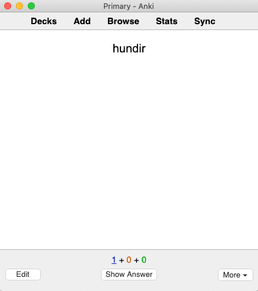

When getting started with language acquisition, your first goal is to build a foundation of understanding.
You need enough comprehension to start learning directly from your immersion.
As mentioned in the last article, the fastest way to build this foundation is to memorize the most common vocabulary.

### Study Tools
There are many different memorization tools and techniques.
In our opinion, spaced repetition systems (SRS) are, by far, the most effective memorization tool.

An SRS is a flashcard program that attempts to track how well you know each flashcard and intelligently shows you the cards it thinks you're about to forget.
This means you can keep a huge amount of information in your head while minimizing unnecessary reviews.

The best SRS tool currently available is [Anki][anki].
Anki has many features and add-ons that help with language learning.
It's free on the computer, web, and Android, but it costs $25 on iOS.

Anki is a bit complicated so it's best to set aside some time to install and configure it.
You can find a full guide about how to get started with Anki [here][anki-guide].

### Study Strategy
In immersion learning, your goal is to understand; not speak.
That means that you only need to build your passive vocabulary: the set of words you can recognize and understand.

You don’t need to practice recalling words from memory.
By the time you reach Stage 3, your brain will naturally start converting your passive vocabulary into active vocabulary and you will be able to recall the words without extra effort.

### Choosing a Word List
Anki "decks" are premade collections of Anki flashcards that you can download and study.
The Refold community is hard at work building Anki decks that are ideal for new learners.

To access these decks, join the free [Refold Discord community][join-link] for your language.

If there's no Refold deck available for your target language (TL), you can either use a premade deck from a different source, or you can create your own deck.

#### Choosing a Premade Deck
In a good premade deck, each card will have a word, an example sentence, a definition, and ideally, audio for the word/sentence.

The Refold community has compiled lists of the best existing decks for each language.
Join the [community][join-link] to access these recommendations.

#### Creating Your Own Deck
If you can’t find a good premade deck that fits the criteria above, you can create your own and share it with the community.

The first step to creating a deck is to choose the words you want to learn.
The best way to do this is with a frequency list.
A "frequency list" is a list of words sorted from most common to least common.
You can find frequency lists for any language by searching on Google.

When choosing a frequency list, make sure that it’s a list of root words, not conjugated/inflected words.
For example, "walk" and "walking" should be treated as the same word.

If your native language (NL) and TL are related (like English and Spanish), then there will be a lot of shared words between the languages.
These shared words are called "cognates" and you don't need to study them.

Once you have your list of words, you will need to gather the necessary information for each word and load it into Anki.
There are many types of cards you can create, but we recommend that you keep it simple.

On the front of the card, put the word.

On the back, put an example sentence and a definition.

Beginners may also want to put a translation of the example sentence on the back to help them understand.
However, as you improve, you should avoid using translations because they are nearly always inaccurate.

Also, remember that you are only studying for recognition and understanding.
Make sure that the front of the card does not have any of your NL on it; only your TL.

### SRS Best Practices
Every new word you learn comes back as multiple reviews later on.
One of the most common mistakes new learners make is learning too many cards too quickly.
Too many new cards leads to too many reviews, which often leads to burnout.

Focus on consistency over quantity.
We recommend adding 10 new cards per day.
With 10 new cards per day, you should expect to have about 70 reviews per day.
It takes about two weeks for your review count to reflect changes to your new card count.

If you ever start burning out, then stop adding new cards until the number of reviews drops down to a more manageable level.
Feel free to drop down to 5 new cards per day, or whatever you find manageable.

[anki]: https://apps.ankiweb.net/
[anki-guide]: /roadmap/stage-1/a/anki-setup
[join-link]: /join