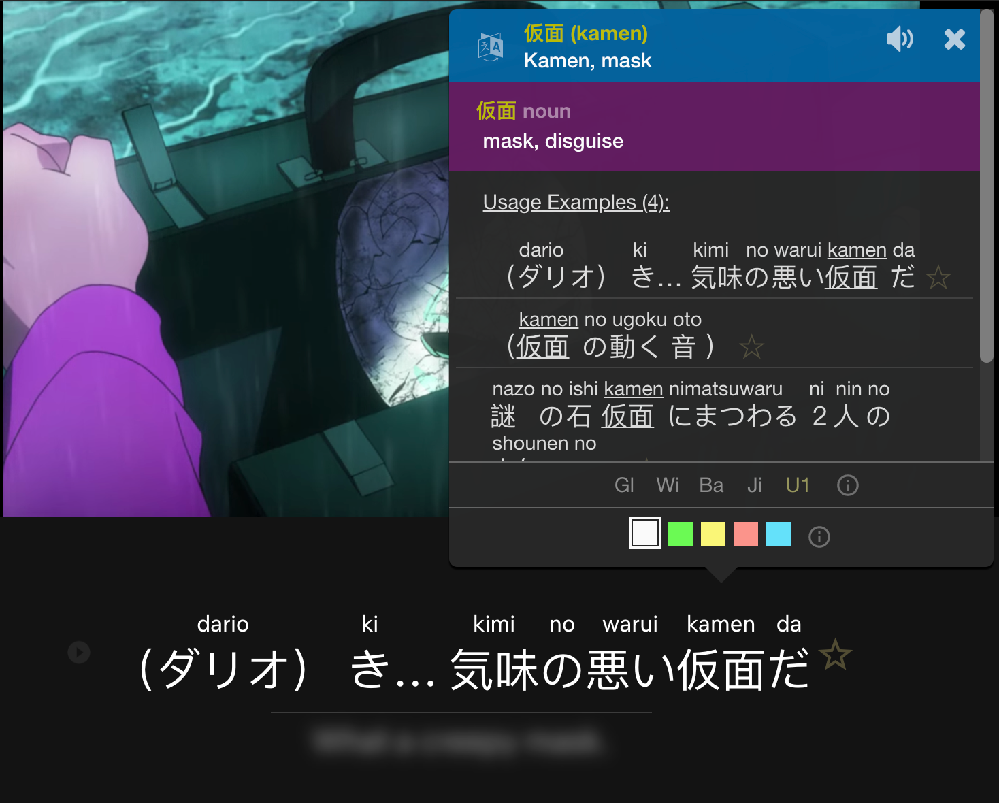

Intensive immersion is a great way to build up your reading ability and vocabulary.
When first getting started, books and blogs will be too difficult to read.
Instead, we recommend reading target language (TL) subtitles while watching a TV show.

There are four main reasons why we recommend starting with subtitles:
1. The visuals of the TV show provide extra context that helps you understand.
1. The audio of the TV show will help you learn the correct pronunciation of the words you’re reading.
1. Hearing the subtitles pronounced out loud helps you parse the grammar of sentences.
1. Subtitles are the written text of a conversation. Conversation generally contains easier language than novels and blogs.

### How to Intensively Immerse
During intensive immersion, your goal is to understand as much as possible.
To do this, stop after each subtitle line and try to understand the sentence.
If there are unknown words in the sentence, use a dictionary to look them up.

As you immerse, some of the language you come across will be easy to figure out, while other parts will be hard.
There will be many sentences that you won't be able to understand, even with the help of a dictionary.

Focus on learning the things that your brain is ready for.
If you can't figure out a sentence after 10 seconds of thinking, then just move on to the next one.

In traditional education, you’re told to exert lots of effort to learn the hard things.
In immersion learning, it is a better strategy to only focus on the easy things.
As your comprehension grows, the things that used to be hard will become easy.

### What Content to Watch
#### Subtitles
Without strong listening ability, looking up words from audio alone is very difficult.
It's important to find content where the TL subtitles match the TL audio.
Without subtitles, you won't be able to intensively immerse with TV and movies.

TL subtitles for native content usually match the audio, but this usually isn’t true for dubbed content.
As a beginner, matching subtitles are important so you can hear the correct pronunciation of words.
When you're more advanced it's ok to watch with mismatched subs.

Most common languages have a lot of subtitled content.
The Refold community is compiling a list of this content to make it easy for beginners to get started.

However, less common languages may not have any subtitles available.
If you can’t find any TL content with subtitles, then we recommend doing intensive immersion with comic books instead.
We’ll explain more about reading comics in Stage 2B.

#### Children's Content
Native content meant for adults (16+ years old) is difficult for new learners.
It’s easier to start with children’s content instead.

We recommend starting with TV shows for children aged 7 to 14.
Children's TV shows have simpler storylines and dialogue, which make them easier to understand.

We don't recommend TV for babies or toddlers.
There is very little language in these shows and they are boring for adults.

#### Rewatching Content
Increasing comprehension is the best way to accelerate acquisition.
The more comprehensible something is, the more engaging it will be and the more your brain will be able to learn.

One great strategy for increasing comprehension and engagement is to watch content twice: once free-flow and once intensive.
Because you've already seen the show once, you'll have more context, higher comprehension, and your intensive immersion will be more engaging.
The second pass of intensive immersion allows you to fill in the mystery of everything you didn't understand the first time through.

For shows you haven't watched before, you can boost comprehension by reading plot summaries before/after watching.
This will help your understanding of the story, give you hints about words, and help keep you engaged.

### Avoiding Burnout
Intensive immersion can be mentally exhausting.
It takes a lot of energy and focus.
When you get tired of intensive immersion, switch to free-flow immersion.

If a piece of content ever starts to feel like a chore to watch or read, then change to something else.
There’s no point in forcing yourself to immerse with content.
Enjoyment is the most important part of the process.

### Immersion Tools
#### Pop-Up Dictionaries
When watching or reading something, you will be looking words up in a dictionary.
Using a digital dictionary is much faster than using a physical one, but it still requires you to switch application windows to look something up.

Pop-up dictionaries allow you to look up words right inside the application you’re using to watch the TV show.

If you have Netflix, we recommend using the Chrome extension [Language Learning with Netflix][llwn-link].
This extension allows you to automatically pause after each line and use a built-in pop-up dictionary to look up words.
The extension is free to use, but also has a paid version with some additional features you may find valuable.

The same company that created the Language Learning with Netflix extension also created a [Language Learning with YouTube][llwyt-link].

Here are some other pop-up dictionaries you can use when browsing the web:
* [Built-in Mac][mac-dictionary] dictionary
* [Yomichan][yomichan] (For Japanese)

#### MPV
If you prefer to watch content locally on your computer, then we recommend the video player [MPV][mpv-link].
MPV is open source and many community members have built add-ons that make MPV a perfect language learning tool.

MPV is a bit complicated so we’ve created a [video guide][mpv-guide] to help you get set up.

### Finding Subtitled Content
#### YouTube
YouTube is a great resource for finding TV shows and other interesting native content.
Every video on YouTube has auto-generated subtitles, but these aren’t accurate.
To find content with accurate subtitles, use YouTube's [advanced search][youtube-sub-search] feature.

#### Netflix
If you are using Netflix, any content orginally created in your TL will have matching subtitles.

If you are watching dubs, look for subtitle tracks marked "CC" which stands for "Closed Captions".
If the subtitle track isn't marked with CC, it probably won't match the audio.

#### TL Streaming Services
Remember to branch out and try new media streaming sites.
Every country has its own media and streaming services.
These services will likely have a lot of content available with matching subtitles.

#### Refold
Our community has collected lists of content with matching subtitles.
[Join here][join-link] to get access to our resource collections.

[join-link]: /join
[llwn-link]: https://languagelearningwithnetflix.com/
[llwyt-link]: https://chrome.google.com/webstore/detail/language-learning-with-yo/jkhhdcaafjabenpmpcpgdjiffdpmmcjb
[yomichan]: https://chrome.google.com/webstore/detail/yomichan/ogmnaimimemjmbakcfefmnahgdfhfami
[mac-dictionary]: https://wokabulary.com/blog/the-built-in-dictionary-on-mac-and-iphone.html
[mpv-link]: https://mpv.io/
[mpv-guide]: https://youtu.be/bbg6ztWecbU
[youtube-sub-search]: https://support.google.com/youtube/answer/3029103?hl=en
